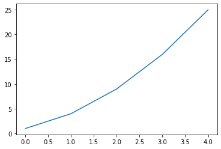
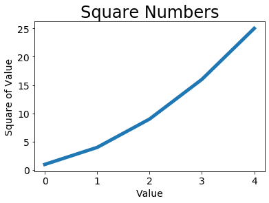
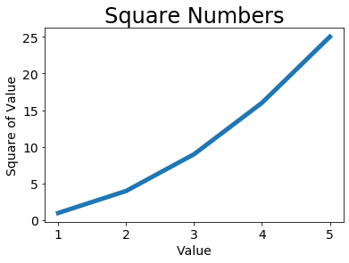
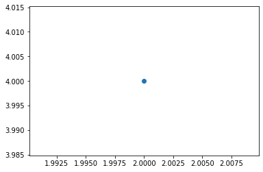
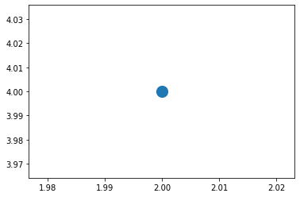
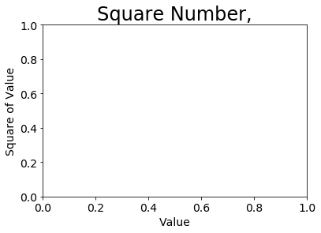
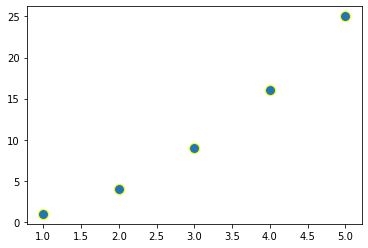
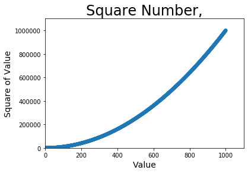
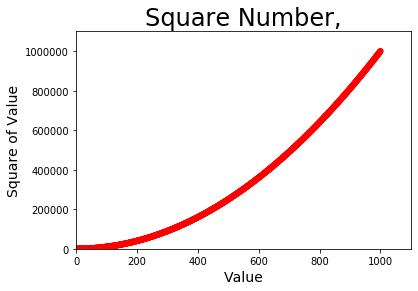
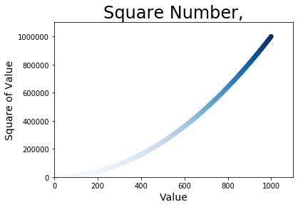

#  15.生成数据

## 15.2 绘制简单的折线图


```python
import matplotlib.pyplot as plt

squares = [1,4,9,16,25]
plt.plot(squares)
plt.show()
```





### 15.2.1 修改标签文字和线条粗细


```python
import matplotlib.pyplot as plt
squares = [1,4,9,16,25]
plt.plot(squares, linewidth=5)

#设置图表标题，并给坐标轴加上标签
plt.title("Square Numbers", fontsize=24) 
plt.xlabel("Value", fontsize=14) 
plt.ylabel("Square of Value", fontsize=14)

# 设置刻度标记的大小 
plt.tick_params(axis='both', labelsize=14) 
plt.show()
```





### 15.2.2 校正图形


```python
import matplotlib.pyplot as plt

input_values = [1,2,3,4,5]
squares = [1,4,9,16,25]
plt.plot(input_values, squares, linewidth=5)

#设置图表标题，并给坐标轴加上标签
plt.title("Square Numbers", fontsize=24) 
plt.xlabel("Value", fontsize=14) 
plt.ylabel("Square of Value", fontsize=14)

# 设置刻度标记的大小 
plt.tick_params(axis='both', labelsize=14) 
plt.show()
```





### 15.2.3 使用scatter()绘制散点图并设置其样式

**绘制单个点时，可使用函数scatter(),并向其传递一对X和Y坐标**


```python
import matplotlib.pyplot as plt

plt.scatter(2, 4)
plt.show()
```





```python
# 使图表更加有趣
import matplotlib.pyplot as plt

plt.scatter(2, 4,s=200) #实参s设置了绘制图形时使用的点的尺寸
plt.show()
  
#设置图表标题并给坐标轴加上标签
plt.title("Square Number,", fontsize=24)
plt.xlabel("Value", fontsize=14)
plt.ylabel("Square of Value", fontsize=14)

#设置刻度标记大小
plt.tick_params(axis='both', which='major', labelsize=14)

plt.show()
```








### 15.2.4 使用scatter()绘制一系列点


```python
import matplotlib.pyplot as plt

x_value =[1,2,3,4,5]
y_value =[1,4,9,16,25]

plt.scatter(x_value, y_value, s=100)
```


    <matplotlib.collections.PathCollection at 0x27e46f89448>





### 15.2.5 自动计算数据


```python
# 绘制1000个点
import matplotlib.pyplot as plt

x_values = list(range(1,1001))      #range()函数创建一个列表，从1-1001，不包括1001
y_values = [x**2 for x in x_values] #遍历x值，计算x平方，并将其存储在y_value中

plt.scatter(x_values, y_values, s=40)

#设置图表标题并给坐标轴加上标签
plt.title("Square Number,", fontsize=24)
plt.xlabel("Value", fontsize=14)
plt.ylabel("Square of Value", fontsize=14)

#设置每个坐标轴的取值范围
plt.axis([0, 1100, 0, 1100000]) #x坐标轴的取值范围为0-1100，坐标轴的范围是0-110000

plt.show()
```


```python
import matplotlib.pyplot as plt

x_values = list(range(1, 1001)) 
y_values = [x**2 for x in x_values]

plt.scatter(x_values, y_values, s=40) 

# 设置图表标题并给坐标轴加上标签 -
plt.title("Square Number,", fontsize=24)
plt.xlabel("Value", fontsize=14)
plt.ylabel("Square of Value", fontsize=14)
# 设置每个坐标轴的取值范围
plt.axis([0, 1100, 0, 1100000]) 
plt.show()
```


### 15.2.6 删除数据点的轮廓


```python
# 删除数据点的轮廓 scatter()传递实参edgecolor='none'
import matplotlib.pyplot as plt

x_values = list(range(1, 1001)) 
y_values = [x**2 for x in x_values]

plt.scatter(x_values, y_values, edgecolor='none', s=40) 

# 设置图表标题并给坐标轴加上标签 -
plt.title("Square Number,", fontsize=24)
plt.xlabel("Value", fontsize=14)
plt.ylabel("Square of Value", fontsize=14)
# 设置每个坐标轴的取值范围
plt.axis([0, 1100, 0, 1100000]) 
plt.show()
```





### 15.2.7 自定义颜色


```python
# 修改数据点的颜色，向scatter()传递参数c，并将其设置为要使用的颜色名称


import matplotlib.pyplot as plt

x_values = list(range(1, 1001)) 
y_values = [x**2 for x in x_values]

plt.scatter(x_values, y_values, c='red', edgecolor='none', s=40) 

# 设置图表标题并给坐标轴加上标签 -
plt.title("Square Number,", fontsize=24)
plt.xlabel("Value", fontsize=14)
plt.ylabel("Square of Value", fontsize=14)
# 设置每个坐标轴的取值范围
plt.axis([0, 1100, 0, 1100000]) 
plt.show()

```





### 15.2.8 使用颜色映射


```python
# 根据点的y值来设置颜色深浅
import matplotlib.pyplot as plt

x_values = list(range(1001))
y_values = [x**2 for x in x_values]

plt.scatter(x_values, y_values, c=y_values, cmap=plt.cm.Blues, edgecolor='none',s=40)
# y值较小的为浅蓝色，y值大的为深蓝色
# 设置图表标题并给坐标轴加上标签 -
plt.title("Square Number,", fontsize=24)
plt.xlabel("Value", fontsize=14)
plt.ylabel("Square of Value", fontsize=14)
# 设置每个坐标轴的取值范围
plt.axis([0, 1100, 0, 1100000]) 
plt.show()
```





## 15.3 随机漫步

### 15.3.1 创建RandomWalk()类


```python
from random import choice

class RandomWalk():
"""一个随机漫步数据的类"""
def __init__(self,num_points=5000):
"""初始化随机漫步的属性"""
    self.num_points = num_points
   # 所有随机漫步都始于（0,0）
    self.x_values = [0]
    self.y_values = [0]
def fill_walk(self): 
    """计算随机漫步包含的所有点""" 
# 不断漫步，直到列表达到指定的长度 
    while len(self.x_values) < self.num_points: 
   # 决定前进方向以及沿这个方向前进的距离 
    x_direction = choice([1, -1]) 
    x_distance = choice([0, 1, 2, 3, 4]) 
    x_step = x_direction * x_distance 
    y_direction = choice([1, -1]) 
    y_distance = choice([0, 1, 2, 3, 4]) 
    y_step = y_direction * y_distance 
    # 拒绝原地踏步 
     if x_step == 0 and y_step == 0: 
        continue
     # 计算下一个点的x和y值 
     next_x = self.x_values[-1] + x_step
    next_y = self.y_values[-1] + y_step 
    self.x_values.append(next_x) 
    self.y_values.append(next_y)   
import matplotlib.pyplot as plt 

from random_walk import RandomWalk 
   # 创建一个RandomWalk实例，并将其包含的点都绘制出来 
    rw = RandomWalk() rw.fill_walk() 
    plt.scatter(rw.x_values, rw.y_values, s=15) 
    plt.show()
```


      File "<ipython-input-2-1ec1cd3a3834>", line 4
        """一个随机漫步数据的类"""
                       ^
    IndentationError: expected an indented block
    


```python

```


```python

```


```python

```


```python

```


```python

```
